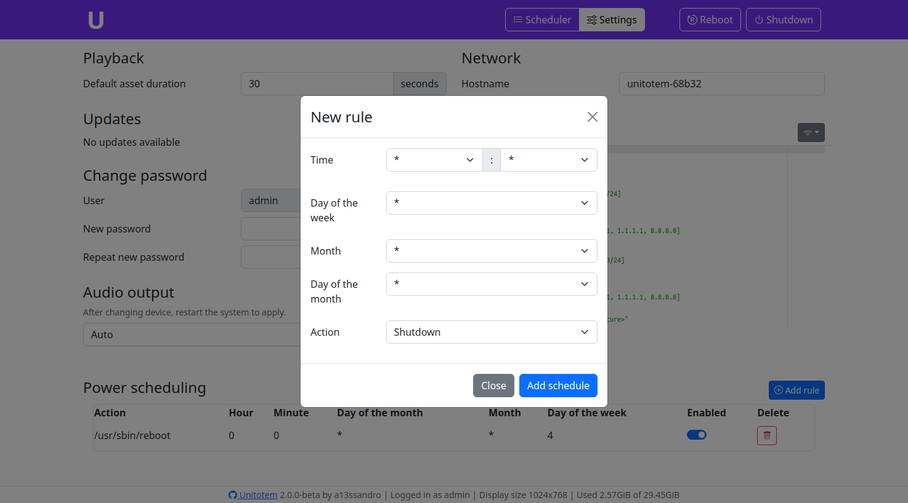

# UniTotem
Managed Raspberry Pi kiosk mode image.

## Installation
1. Download the latest image from the Releases page and install it with [Raspberry Pi Imager](https://www.raspberrypi.com/software/) on a micro SD card (class 10 is strongly suggested for speed).
2. Insert the micro SD in a Raspberry, connect it to a screen and boot it, during first boot the filesystem will be expanded and hostname will be set to `unitotem-xxxxx` where x is a random alphanumeric character (useful if you have more than one in the network).
3. After first boot is completed, UniTotem loading screen will appear, but the manager still cannot control it (I still haven't find the cause of this bug), so you have to reboot the Pi (unplugging and replpugging is ok at this stage).

4. After the second boot completes, you should firstly see the loading screen and then the welcome screen with the hostname and IP address in the bottom left corner.

If the Raspberry is not connected to a network, it will create a fallback hostspot and its SSID and password will be displayed together with a QR code for fast connection.

## Usage
1. Open a browser and go to the IP address shown in the corner, username: `admin`, password: `admin` (CHANGE it in the [settings](#change-password)), you will see a page like this one:

The buttons on the left of the "Add asset" button are:
    - Previous asset
    - Reload asset
    - Next asset
2. Use the Add asset button to add the URL of a page to the list or the Files button to upload a new file (after you upload a file the page will reload so you need to reopen the File manager window), then click on the rightmost button near the name of the file you just uploaded to add it to the assets list.

3. Enable the asset using the toggle switch.

## Configuration

### Playback
Default asset duration: Default time length each asset is shown (except for videos).
### Updates
Simple and quick frontend for apt.
### Change password
Change admin password for UniTotem.
### Audio output
Select the audio output device. After selecting the new device you have to reboot the system, otherwise Chromium won't change output device.
### Network
Hostname: change device name advertised in the network.

Network configuration relies on the more advanced netplan instead of the classic dhcpcd5, you can use the commented template to setup a static IP or to connect to a wireless network.
### Power scheduling
Schedule shutdowns and reboots with cron.


## System and management
### SSH
In order to provide quick ssh access the default user `pi` has a default password: `unitotem`, it's strongly advised to change it as soon as possible (log in via ssh and use `passwd` to set a new one), or to use the user renaming function in Raspberry Pi Imager.

The default prompt for changing password on first boot is disabled so that the system can be connected in place without ever using a keyboard, but this workaround requires what said above.

### Configuration file
UniTotem configuration file is located at `/etc/unitotem/unitotem.conf`.

## Building
UniTotem system image creation is based on [pi-gen](https://github.com/RPi-Distro/pi-gen), to start the building process you need to:
- Install the required packages:
  ```sh
  apt-get install coreutils quilt parted qemu-user-static debootstrap zerofree zip \
  dosfstools libarchive-tools libcap2-bin grep rsync xz-utils file git curl bc \
  qemu-utils kpartx gpg pigz
  ```
- Clone this repository to a base path WITHOUT spaces.
- Run `sudo ./build.sh` in the base path of the repository.

For further information about the building process refer to the pi-gen repository page.

## Known bugs
- On first boot the manager connects to Chromium but doesn't control the page displayed, so it's required to reboot the Pi in order to make it work

## TODO
- Add configuration Backup/Restore functionality
- Add insufficient space warning when uploading files
- Provide the manager as a separate package that can be updated separately from the whole system image


#
#

[](https://www.buymeacoffee.com/a13ssandr0)

[](https://www.paypal.com/donate/?hosted_button_id=9RHPMJAS26TJN)
